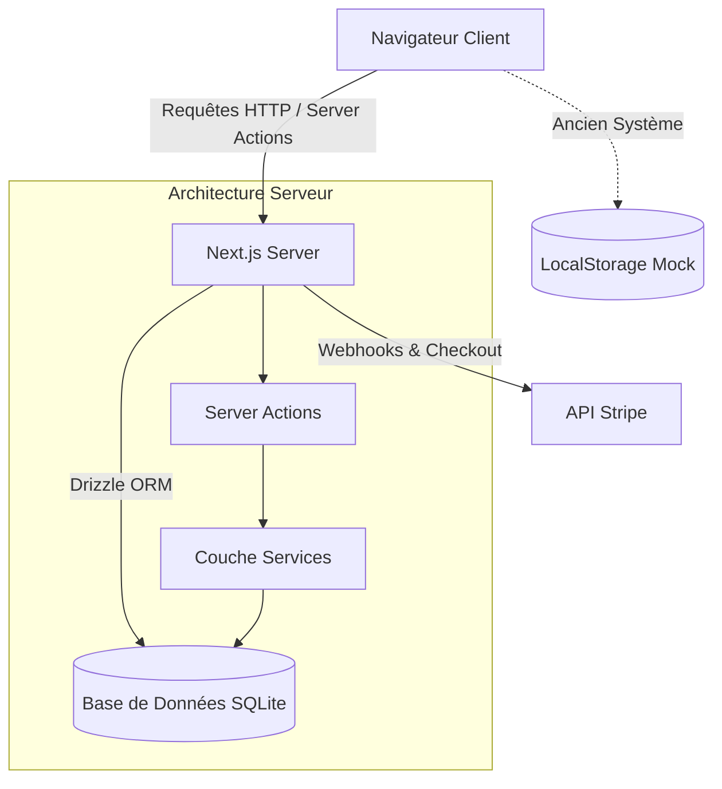
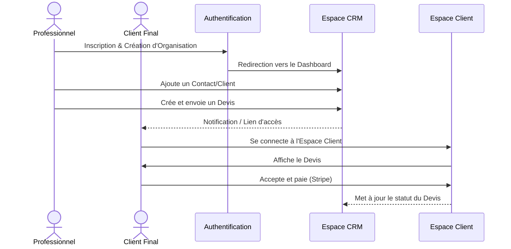
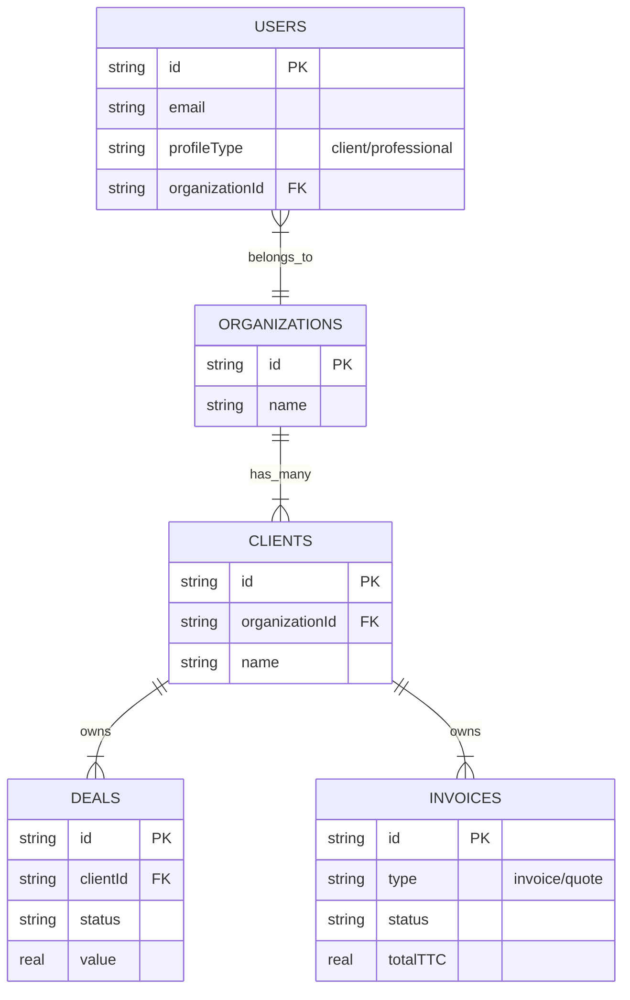

# Audit Complet et Passation du Projet - MonService

## 1. Résumé exécutif
MonService est une plateforme CRM SaaS (Software as a Service) développée avec le framework Next.js (App Router). Le projet se trouve actuellement dans une phase de transition architecturale critique. Initialement conçu autour d'une architecture de type "Mock" avec une base de données locale stockée dans le navigateur (`localStorage`) via des `repositories`, il est en cours de migration vers une véritable base de données SQLite en utilisant Drizzle ORM et `better-sqlite3` via des `services`. Cette hybridation structurelle occasionne actuellement des erreurs de build, des incohérences de données et une dette technique nécessitant une intervention prioritaire avant toute mise en production.

## 2. Présentation du projet
* **Objectif** : Offrir une solution tout-en-un de gestion de la relation client (CRM) incluant la facturation, une marketplace de demandes, le suivi des opportunités (deals), une messagerie interne et la gestion des tâches.
* **Problème auquel il répond** : Centraliser l'activité des professionnels de service (freelances, agences) et offrir un espace de suivi transparent à leurs clients finaux.
* **Utilisateurs concernés** :
  * Les **Professionnels** (gestion complète du CRM).
  * Les **Clients** (accès simplifié à leurs factures, devis et discussions).
* **Fonctionnalités principales** : CRM (Kanban), Devis/Factures, Marketplace, Espace Client, Tableau de bord, Gestion documentaire.

## 3. État actuel du projet
* **Statut de développement** : Hybride (en plein milieu d'une refonte back-end).
* **Fonctionnalités fonctionnelles** : Interface utilisateur riche, routage Next.js, formulaires, design system.
* **Limites connues** : Les imports de `better-sqlite3` génèrent des erreurs côté Client, certaines pages nécessitant le mode "Client" dans Next.js sont configurées en Server Components, entraînant l'échec du processus de Build.
* **Dette technique** : Très élevée en raison du système hybride (SQLite vs LocalStorage).
* **Points à améliorer en priorité** : Éliminer complètement l'usage de `localStorage` et des anciens `repositories`, corriger les imports illégaux de modules serveur (`fs`) sur les composants clients.

## 4. Stack technique
* **Core** : Next.js 16 (App Router), React 19, TypeScript.
* **Style & UI** : Tailwind CSS v4, Lucide React (icônes), Recharts (data viz), FullCalendar (calendriers).
* **Validation & Formulaires** : React Hook Form, Zod.
* **Données & ORM** : Drizzle ORM, SQLite (`better-sqlite3`).
* **Paiement** : Stripe, @stripe/stripe-js.
* **Autres** : `bcryptjs` pour le hashage de mot de passe factice, `react-pdf/renderer`.

## 5. Architecture générale
Le projet adopte une structure moderne basée sur Next.js avec une stricte séparation front/back logique, bien que réunis dans le même dépôt (Monolithe).



## 6. Arborescence commentée
* `/src/app` : Les pages, l'API et les Server Actions.
  * `/(dashboard)` : Espace réservé aux professionnels.
  * `/client` : Espace réservé aux clients finaux.
  * `/actions` : Fonctions exécutées sur le serveur (Server Actions).
  * `/api` : Points de terminaison REST (particulièrement pour Stripe).
* `/src/components` : Composants React.
  * `/crm` : Composants lourds pour l'espace professionnel.
  * `/ui` : Composants génériques (Button, Card, Input).
* `/src/lib/data` : Ancien système. Contient les mocks (`fixtures`), interfaces et `repositories` utilisant `localStorage`.
* `/src/lib/db` : Nouveau système (Schéma Drizzle ORM et instance de connexion SQLite).
* `/src/lib/services` : Nouveau système d'accès aux données (liées à Drizzle).
* `/src/lib/stripe` : Implémentation des paiements et de Stripe Connect.
* `/src/lib/validation` : Schémas Zod.

## 7. Installation et configuration
**Prérequis** : Node.js (v18 ou supérieur), npm.

```bash
# 1. Cloner le projet
git clone <url_du_depot>

# 2. Installer les dépendances
npm install

# 3. Configurer les variables d'environnement (Créer un fichier .env.local)
cp .env.example .env.local

# 4. Initialiser la base de données SQLite
npx drizzle-kit push:sqlite
```

## 8. Variables d'environnement
À définir dans le fichier `.env.local` à la racine (Aucun secret réel dans cette documentation) :
```env
DATABASE_URL=./database.sqlite

# Stripe (Paiement)
NEXT_PUBLIC_STRIPE_PUBLISHABLE_KEY=pk_test_...
STRIPE_SECRET_KEY=sk_test_...
STRIPE_WEBHOOK_SECRET=whsec_...
```

## 9. Lancement en développement
```bash
npm run dev
```
Accessible sur `http://localhost:3000`.

## 10. Build, tests et déploiement
* **Build de production** : `npm run build`
* **Linting** : `npm run lint`
* **Tests** : Il existe un répertoire de test basique, mais des outils comme `Playwright` ou `Jest` devront être configurés plus solidement.
* **Déploiement** : Attention, Vercel ne supporte pas SQLite nativement en écriture (Système de fichiers éphémère). Il est recommandé d'utiliser une solution serveur (VPS, Docker, Render) ou de migrer vers LibSQL/Turso ou PostgreSQL.

## 11. Parcours utilisateurs


## 12. Fonctionnalités détaillées
* **CRM (Professionnel)** : Pipeline Kanban des deals (`src/components/crm/DealPipeline.tsx`), rapports avancés, gestion des clients.
* **Facturation** : Création de devis/factures avec PDF généré, paiement Stripe, signature électronique (`src/components/crm/SignaturePad.tsx`).
* **Marketplace** : Demandes publiques déposées par les clients et réponses des professionnels.
* **Espace Client** : Accès limité et sécurisé aux documents, tâches et messages partagés.

## 13. Logique métier complète
* **Rôles et permissions** : Gérés via le champ `profileType` (`'professional'` ou `'client'`). Le `RoleGate.tsx` et `ProtectedLayout.tsx` assurent le routage automatique (les clients ne peuvent pas accéder à `/(dashboard)`).
* **Création d'entité sécurisée** : Les Server Actions vérifient que `user.organizationId` correspond à l'organisation de l'entité manipulée.
* **Cycle de vie Devis/Facture** : Draft -> Sent -> Viewed -> Paid/Cancelled. Le paiement via Stripe déclenche un webhook (`/api/stripe/webhook`) qui met à jour le statut.

## 14. UI/UX et design system
* **Composants globaux** : `Header`, `Sidebar`, structurés dans `DashboardShell`.
* **Réactivité** : L'interface utilise Tailwind CSS et est intégralement responsive. La navigation latérale se rétracte sur mobile via un menu hamburger.
* **Feedback visuel** : Utilisation de `react-hot-toast` pour confirmer les actions asynchrones, et de Skeletons (`src/components/crm/Skeleton.tsx`) pour le chargement.
* **Alerte UX** : Certains parcours complexes n'utilisent pas encore l'indicateur de chargement asynchrone natif de Next.js (`useFormStatus`), ce qui provoque des clics multiples possibles.

## 15. Modèles de données


## 16. Base de données et persistance
* **Hybridation critique (Dette)** : 
  * Certains appels (`client.service.ts`) passent via Drizzle et tapent dans le fichier `./database.sqlite`.
  * D'autres appels historiques continuent d'utiliser les classes enfants de `BaseRepository` (`client.repository.ts`) qui modifient le `localStorage`.
  * L'unification est impérative pour le bon fonctionnement.

## 17. API et services externes
* **Stripe** :
  * `/api/stripe/checkout` : Génère les liens de paiement de factures.
  * `/api/stripe/connect/onboarding` : Pour l'encaissement de paiements par des tiers (Marketplace).
  * `/api/stripe/webhook` : Route sécurisée par signature écoutant les événements de paiement.

## 18. Authentification et permissions
* L'authentification actuelle (basée sur `bcryptjs` et cookies manuels dans `session.ts`) est fonctionnelle mais artisanale.
* `AuthContext` (modifié pour corriger les types `any`) hydrate l'interface.
* Le mécanisme de cookie `session` n'utilise pas de JWT crypté, mais stocke l'ID utilisateur. C'est un point à sécuriser.

## 19. Sécurité
* **Risque Élevé** : Stockage du `session.id` en clair dans le cookie d'authentification (`src/app/actions/session.ts`).
* **Risque Moyen** : Fuite de dépendances Node.js (`fs`, `better-sqlite3`) dans le bundle client Next.js pouvant exposer des routes ou planter l'application.
* **Sécurité Drizzle** : Empêche naturellement les injections SQL.
* **IDOR (Insecure Direct Object Reference)** : Vérifications présentes (`organizationId`) mais requièrent une revue ligne par ligne sur les routes Server Actions pour garantir qu'un professionnel A n'édite pas les données du professionnel B.

## 20. Gestion des erreurs
* Une classe utilitaire `AppError` est présente (`src/lib/utils/error-handler.ts`).
* Elle est couplée à un bloc Try/Catch global dans les Server Actions. En cas d'échec, on renvoie : `{ success: false, error: 'message' }`.

## 21. Tests et qualité
* Projet en manque de couverture automatisée (absence de tests unitaire majeurs).
* Les types TypeScript sont stricts, et les anomalies (`any`) ont été révisées.

## 22. Performances
* Utilisation intensive de React (19), mais plusieurs erreurs de conception avec l'usage de `useRouter` sans `use client` bloquent l'optimisation SSR lors du build Next.js.
* Le bundle JavaScript client inclut accidentellement des composants de base de données à cause d'un import mal isolé dans `marketplace/page.tsx` ou des services.

## 23. Dette technique
* **Majeure** : Coexistence de `src/lib/data/repositories` (mock) et `src/lib/services` (vrai backend).
* **Majeure** : Architecture Next.js App Router mal utilisée sur certaines pages manquant de `"use client"`.

## 24. Bugs et anomalies connus
1. **Échec du Build `npm run build`** :
   * Plusieurs composants serveurs utilisent des hooks clients (ex: `useState`, `useRouter` dans `/tasks/page.tsx` et `/tasks/[id]/edit/page.tsx`).
   * La dépendance serveur `better-sqlite3` tente d'être importée dans le navigateur (probablement depuis `/marketplace/page.tsx`).

## 25. Fonctionnalités incomplètes
* Le pipeline de migration de données entre le mock et la DB n'est pas abouti.

## 26. Risques techniques
* **Hébergement** : Impossibilité absolue de déployer sur la plateforme "Vercel" standard si le fichier de base de données est local (`database.sqlite`). Vercel est Serverless ; la BDD locale sera écrasée à chaque appel. **Solution requise :** Hébergement VPS ou migration vers PostgreSQL / LibSQL (Turso).

## 27. Recommandations prioritaires
1. **Ajouter la directive `"use client"`** dans les pages Next.js provoquant le crash du build (`tasks/page.tsx`, etc.).
2. **Isoler les appels Base de données** en s'assurant qu'aucun fichier importé par un `Client Component` ne fait référence à `db/index.ts` ou `better-sqlite3`.
3. **Supprimer le dossier `src/lib/data/repositories`** et tout brancher sur `src/lib/services` avec Drizzle ORM.
4. **Implémenter Auth.js (NextAuth.js)** pour sécuriser réellement les sessions.

## 28. Plan de reprise du projet
1. **Jour 1-2** : Fix des erreurs de Build, résolution des fuites de modules serveurs, séparation claire Client / Serveur.
2. **Jour 3-5** : Nettoyage définitif des Mock Datas (`localStorage`) pour 100% de SQLite.
3. **Jour 6-7** : Sécurisation de l'authentification et préparation de la base de données pour un environnement cloud (Turso ou PostgreSQL).

## 29. Checklist pour un nouveau développeur
- [ ] Examiner `.env.example` et créer un `.env.local`.
- [ ] Comprendre le clivage Next.js (Server Components vs Client Components).
- [ ] Lancer `npm run dev` et inspecter la console.
- [ ] Consulter les schémas dans `src/lib/db/schema.ts`.

## 30. Glossaire
* **Deal** : Opportunité commerciale, souvent affichée dans un Kanban.
* **Server Action** : Fonction back-end Next.js, décorée par `"use server"`, appelée directement depuis le front.
* **Mock / Repository** : Termes utilisés dans l'ancien système pour désigner le faux stockage de données dans le navigateur.

## 31. Tableau des principaux fichiers
| Fichier / Dossier | Rôle | Points de vigilance | Améliorations recommandées |
|---------|------|--------------------|----------------------------|
| `src/app/actions/session.ts` | Authentification | Stocke l'ID utilisateur en clair dans un cookie (vulnérabilité) | Implémenter NextAuth.js |
| `src/lib/db/index.ts` | Initialise Drizzle et SQLite | Ne jamais l'importer dans un composant client | - |
| `src/lib/services/` | Logique métier moderne (BDD) | - | Brancher 100% de l'app ici |
| `src/lib/data/repositories/`| Ancien mock de données | Contradiction avec la BDD, provoque des bugs | **À Supprimer définitivement** |
| `AuthContext.tsx` | État utilisateur UI | Hydratation asynchrone | - |

## 32. Annexes et diagrammes
*(Diagrammes d'architecture, entité-relation et séquence inclus ci-dessus)*
